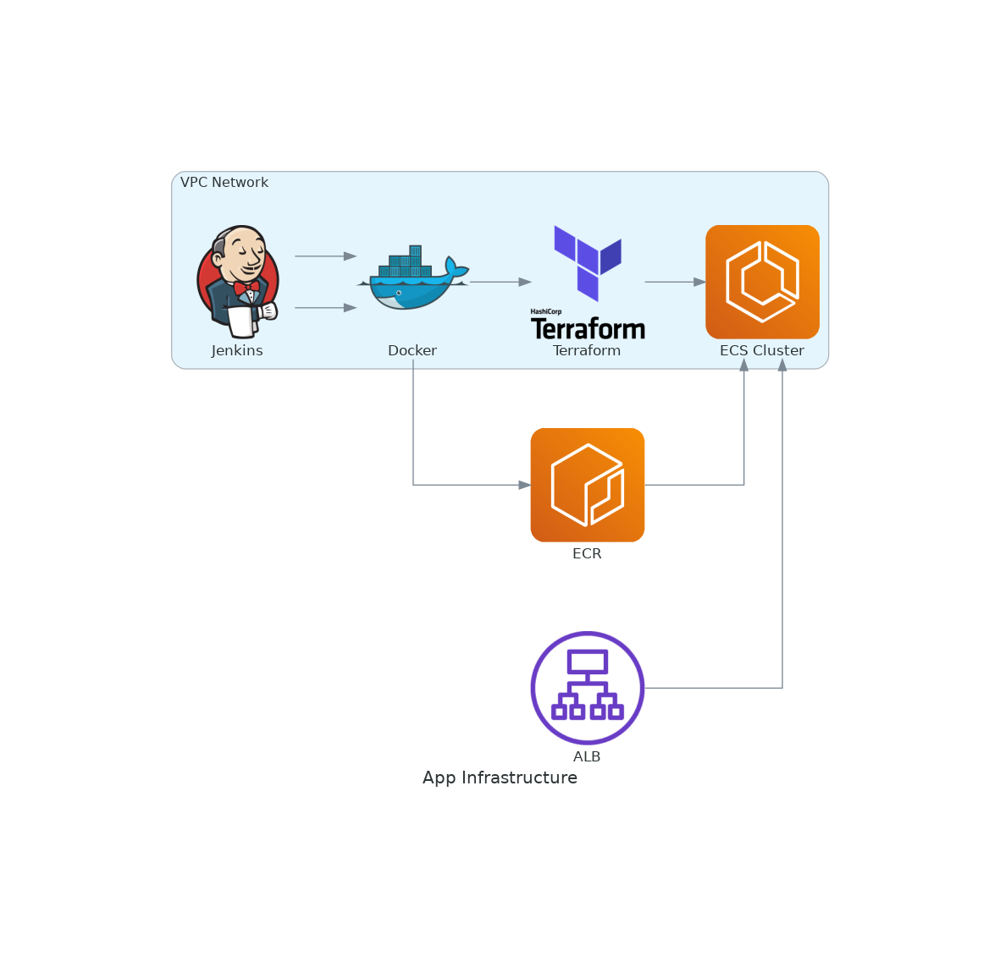

# CI/CD Project on AWS

This project deploys a Database container and a webserver from an AWS Managed Jenkins server. 

Technology stack: Jenkins, Docker, Terraform

Assuming Jenkins has the required permissions

# Prerequists

An ubuntu (20+) with docker, docker-compose and jq installed. 

